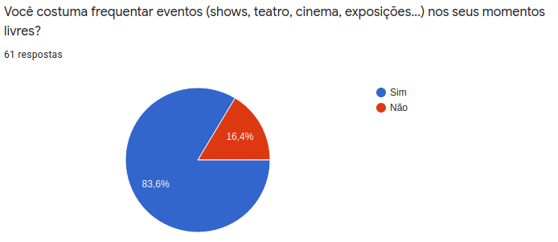
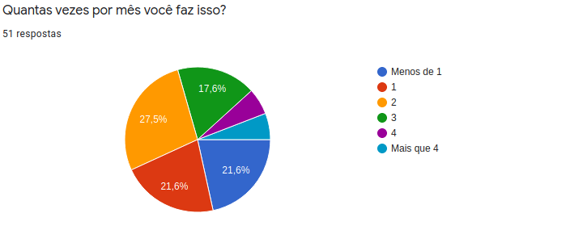
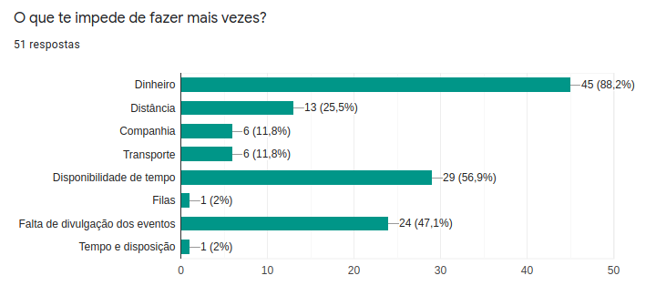
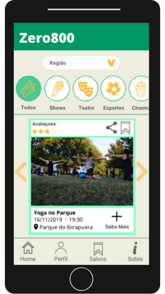
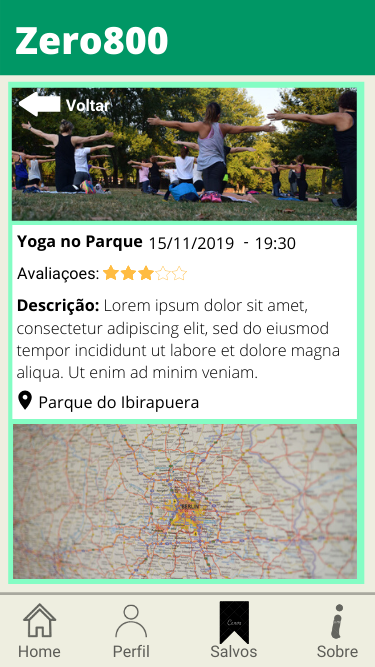
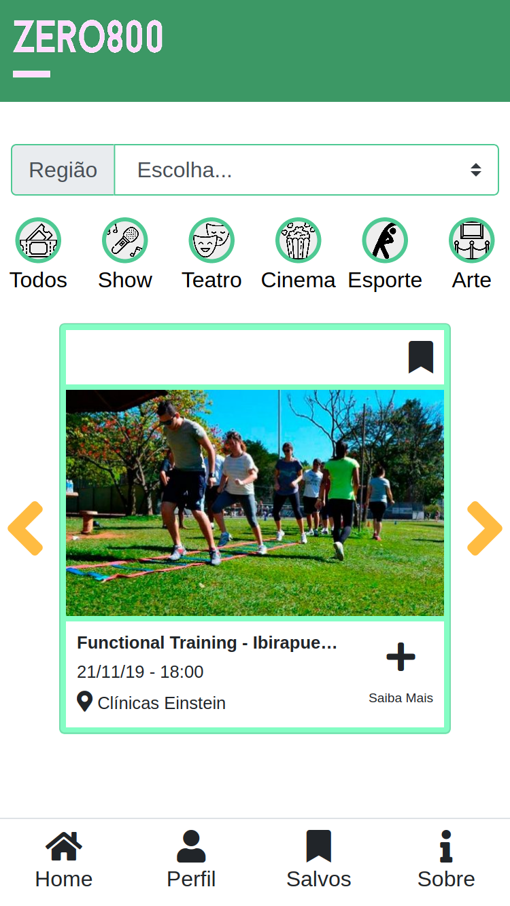
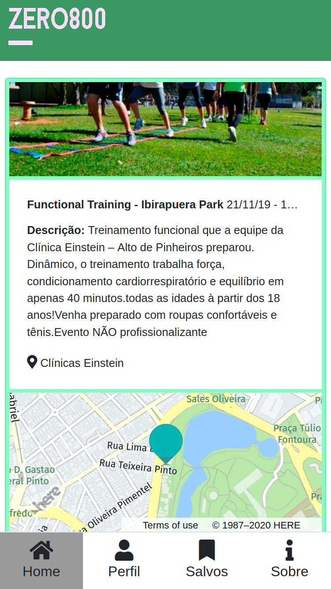

# SAP003-open-house

_Projeto desenvolvido no bootcamp da Laboratoria durante o Hackathon de dois dias, Open House._

***

## Zero800 - Seus roles free

Fomos desafiadas a encontrar problemas no universo do entretenimento e, após pesquisa e validação, escolher e resolver um deles.

Após discussão, decidimos atacar o probelma de acesso a eventos **gratuitos** na cidade de São Paulo de modo simples, rápido e concentrado.

Amostra do resultado da primeira pesquisa:

Após uma semana de _Design Sprint_ chegamos a esse protótipo:

## Versão Final

Tivemos dois dias para desenvolver o produto idealizado; utilizamos de ferramentas de organização como o _Trello_ e definimos prioridades de acordo com nossa pesquisa para a entrega do _MVP_ .

Conseguimos entregar grande parte das Histórias propostas e as restantes foram reservadas para uma possível versão futura do aplicativo.

Essa foi a versão apresentada:

***

## Considerações gerais

### Tecnologias utilizadas

* JavaScirpt (ES6)
* [Eslint](https://www.npmjs.com/package/eslint-config-airbnb)
* [Firebase](https://firebase.google.com/docs?hl=pt-br)
* [Bootstrap](https://getbootstrap.com/docs/4.3/getting-started/introduction/)
* [toastify-js](https://github.com/apvarun/toastify-js)
* [Fontawsome](https://fontawesome.com/how-to-use/on-the-web/using-with/react)
 * [Trello](https://trello.com)
